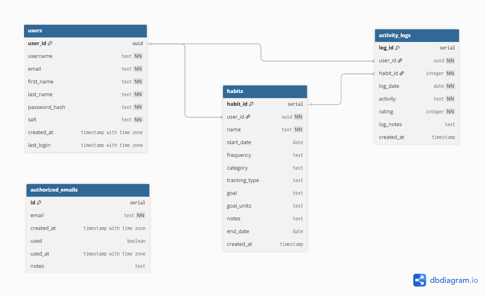

# 📊 Accountability Partner

**Track your habits and activities with ease!**

> A web-based habit tracking app that helps users build consistency, log daily actions, and visualize their progress through interactive dashboards.

🌐 **Live App:** [https://accountabilitypartner.streamlit.app/](https://accountabilitypartner.streamlit.app/)

---

## 🚀 Features

- 🧠 **Create Daily Habits:** Define habits you want to build and track.
- 📅 **Log Daily Activities:** Quickly record your habit-related activities.
- 📊 **Analyze Progress:** Visualize habit consistency, trends, and completion rates.
- 🔐 **Custom Auth System:** Users log in via a custom-built authentication flow (no third-party auth).
- 🧪 **Demo Mode:** Explore the dashboard and analytics using sample (fake) data — no login required.

---

## Data Model
The core entities in Accountability Partner include `users`, `habits`, and `activity logs`. Here's a visual representation of the schema:

---

## 📊 Key Behavioral Insights
The Accountability Partner dashboard provides actionable insights to help users reflect on their behavior and make data-informed adjustments. Some of the insights available include:

- 📈 **Habit Completion Trends:** Visualize consistency over time and identify patterns of momentum or drop-off.
- 📅 **Day-Level Activity Heatmaps:** Detect which days of the week are most productive or prone to missed habits.
- 🔁 **Streak Duration:** Track how long users sustain a habit without interruption, helping reinforce positive reinforcement.
- 🗒️ **Note Patterns (Word Cloud):** Identify recurring themes or emotions in daily habit logs.
- 📊 **Most/Least Performed Habits:** Understand which habits are easiest to maintain versus those needing intervention.
- 🔍 **Time-Based Comparisons:** View progress week-over-week or month-over-month for performance reviews.

Below is a GIF of the Overview Dashboard from the Demo

---

## 🔐 Access & Limitations

Due to backend limits:
- The app currently supports **only pre-configured users**.
- If you're interested in gaining access, please **[reach out](mailto:youremail@example.com)** to be added.

> ⚠️ Expanding to support full registration or multi-user onboarding is planned for future versions.

---

## 📦 Tech Stack

| Layer              | Tools Used |
|--------------------|------------|
| Frontend Interface | Streamlit  |
| Backend & Storage  | Supabase (PostgreSQL) |
| Data Processing    | Python (Pandas, NumPy) |
| Visualization      | Altair, Matplotlib, Calplot, WordCloud |
| Deployment         | Streamlit Cloud |
| Auth System        | Custom Python-based login logic |

---

## 👩🏾‍💻 Development Notes

No setup needed — just visit the live app.

If you're a developer interested in collaborating:
- Reach out to get access to the codebase.
- Contributions to analytics, visualization, or multi-user logic are welcome!

---

## 📬 Contact

Have feedback or want access?

📧 Email: **[ayersamuel210@gmail.com](mailto:ayersamuel210@gmail.com)**  
🌍 LinkedIn: **[Samuel Ayer](https://www.linkedin.com/in/samuel-ayer/)**

---

## 📄 License

MIT License © 2025 Accountability Partner Project
